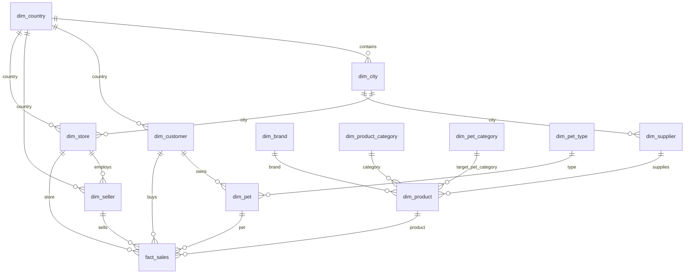

# BigDataSnowflake
Анализ больших данных - лабораторная работа №1 - нормализация данных в снежинку

Одна из задач data engineer при работе с данными BigData трансформировать исходную модель данных источника в аналитическую модель данных. Аналитическая модель данных позволяет исследовать данные и принимать на основе полученных данных решения. Классическими универсальными схемами для анализа данных являются "звезда" и "снежинка". В лабораторной работе вам предстоит потренироваться в трансформации исходных данных из источников в модель данных снежинка.

Что необходимо сделать?

Необходимо данные источника (файлы mock_data.csv с номерами), которые представляют информацию о покупателях, продавцах, поставщиках, магазинах, товарах для домашних питомцев трансформировать в модель снежинка/звезда (факты и измерения с нормализацией).

## Что входит в решение

- `docker-compose.yml` — запуск PostgreSQL 16.
- `download_data.sh` — загрузка 10 исходных CSV-файлов из репозитория задания.
- `init/00_helpers.sql` — функции очистки и приведения типов.
- `init/01_load_raw.sql` — загрузка 10 CSV в сырую таблицу `mock_data`.
- `init/02_create_snowflake.sql` — DDL для таблиц фактов и измерений.
- `init/03_populate_dimensions.sql` — DML для заполнения измерений.
- `init/04_populate_facts.sql` — DML для заполнения таблицы фактов.
- `init/05_views_and_checks.sql` — проверочные и аналитические представления.
- `docs/SCHEMA.md` — описание схемы и зерна факта.

## Запуск

```bash
./download_data.sh
```
или для Windows
```bash
wsl ./download_data.sh
```
```bash
docker compose up -d
```

При первом старте PostgreSQL автоматически выполнит SQL-скрипты из `init/`.

Если база уже запускалась раньше и нужно пересоздать её с нуля:

```bash
docker compose down -v
docker compose up -d
```

## Проверка результата

Количество строк в сырой таблице и фактах:

```bash
docker exec -it snowflake_postgres psql -U postgres -d snowflake_lab -c "SELECT * FROM view_fact_quality;"
```

Ожидаемо: `raw_rows = 10000`, `fact_rows = 10000`, `not_loaded_rows = 0`.

Сводка по таблицам:

```bash
docker exec -it snowflake_postgres psql -U postgres -d snowflake_lab -c "SELECT * FROM view_schema_summary;"
```

Примеры аналитических запросов:

```bash
# Выручка по странам магазинов
docker exec -it snowflake_postgres psql -U postgres -d snowflake_lab -c "SELECT * FROM view_revenue_by_store_country LIMIT 10;"

# Выручка по брендам
docker exec -it snowflake_postgres psql -U postgres -d snowflake_lab -c "SELECT * FROM view_revenue_by_brand LIMIT 10;"

# Выручка по категориям товара и категориям питомцев
docker exec -it snowflake_postgres psql -U postgres -d snowflake_lab -c "SELECT * FROM view_revenue_by_product_category LIMIT 10;"
```

## Схема

Зерно факта: одна строка из CSV = одна продажа в `fact_sales`.



# Описание модели данных


`fact_sales` хранит одну строку на одну исходную строку из CSV. То есть каждая строка `mock_data` соответствует одной продаже.

Ключ связи с источником: `fact_sales.source_row_id -> mock_data.source_row_id`.

## Таблицы измерений

| Таблица | Назначение |
|---|---|
| `dim_country` | Справочник стран покупателей, продавцов, магазинов и поставщиков. |
| `dim_city` | Города магазинов и поставщиков, нормализованные через страну. |
| `dim_customer` | Покупатели. |
| `dim_seller` | Продавцы, связанные с магазином. |
| `dim_store` | Магазины. |
| `dim_supplier` | Поставщики. |
| `dim_product_category` | Категории товара: Food, Toy, Cage и т.п. |
| `dim_pet_category` | Категории питомцев: Cats, Dogs, Fish и т.п. |
| `dim_brand` | Бренды товаров. |
| `dim_product` | Товары с характеристиками, брендом, категорией и поставщиком. |
| `dim_pet_type` | Тип питомца покупателя: cat, dog, bird и т.п. |
| `dim_pet` | Питомцы покупателей. |

## Таблица фактов

`fact_sales` содержит:

- дату продажи;
- связи с покупателем, продавцом, товаром, магазином и питомцем;
- количество купленного товара;
- сумму продажи;
- рассчитанную цену единицы товара.


